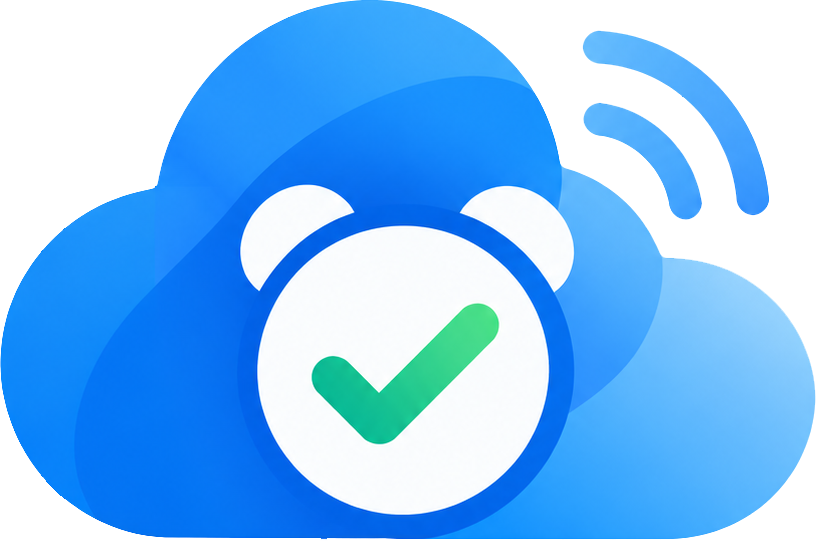

# Cloud Alarm Overlay

[](https://dotnet.microsoft.com/download/dotnet/10.0)
[](#系統需求)
[](https://learn.microsoft.com/dotnet/desktop/wpf/)
[](LICENSE)
[](https://github.com/bruce-yang-422/cloud-alarm-overlay/commits/main/)
[](https://github.com/bruce-yang-422/cloud-alarm-overlay/releases/latest)

Cloud Alarm Overlay 是常駐 Windows 系統匣的桌面提醒程式，將個人任務、團隊通知、專注計時與歷史紀錄放在同一個地方。你可以安排本機任務，也可以從公開的 Google Sheets CSV 同步公司或團隊任務；提醒、確認與操作紀錄儲存在這台電腦。

**[下載 Windows 版](https://github.com/bruce-yang-422/cloud-alarm-overlay/releases/latest)** · [程式介紹](https://bruce-yang-422.github.io/cloud-alarm-overlay/) · [v1.1.0 改版說明](https://github.com/bruce-yang-422/cloud-alarm-overlay/releases/tag/v1.1.0)

## 主要功能

- **任務提醒**：建立一次性或重複的本機任務，支援工作日、假日略過、農曆日期，以及指定月份複選；重複任務以「下一次提醒」計算。
- **分級通知**：一般提醒、重要提醒、緊急提醒、強制通知各有不同的通知效果；強制通知需要輸入畫面上的數字確認碼。
- **Google Sheets 同步**：讀取 Sheet A 的任務、假日、人員與農曆對照，以及 Sheet B 的團隊任務。雲端任務在程式內唯讀，可複製成本機任務再修改。
- **番茄鐘**：專注與休息計時、音效設定，以及每日進度和歷史紀錄。
- **任務詳細預覽**：在首頁「即將到來的任務」、「我的任務」及「歷史紀錄」雙擊任務名稱，查看詳細內容與備註，支援 Markdown、特殊符號與 emoji。
- **查詢與匯出**：查詢任務提醒、確認與番茄鐘紀錄，並匯出 CSV；新產生的提醒紀錄保存當次任務內容快照。
- **任務產生器**：從側邊欄底部、狀態區上方或系統匣開啟表單，選擇通知對象、產生 Sheet 資料列或匯出 Excel；已設定 Sheet B 時，也會開啟對應的任務分頁。
- **設定與程式資訊**：在「設定 → 通知音效」預覽四種提醒；「我的裝置」提供裝置識別、作者 Bruce Yang、最後更新日期（安裝包建置日期）及目前程式版本。
- **外觀與狀態**：先選淺色、暗色或跟隨系統，再選預設、粉紅或若竹色彩；側邊欄分開顯示本機排程與各雲端來源的正常／異常／中斷狀態。
- **管理者專區**：設定同步來源、通知政策、開機啟動與結束程式密碼保護，查看系統／稽核紀錄，執行備份與還原。
- **系統匣常駐**：關閉主視窗後仍持續執行提醒；從系統匣選單可重新開啟或結束程式。

### v1.2.0 特色：倒數／正數（待發布）

v1.2.0 新增獨立的「倒數／正數」頁面，可新增、編輯、刪除項目，並將最多兩個倒數釘選到首頁；此功能尚未包含於已發布的 v1.1.0 安裝檔。

- 可選「倒數／正數」與日期／日期時間精度：倒數顯示距離目標還有多久；正數顯示從起始日期已過多久，未開始時顯示「尚未開始」。
- 日期顯示方式提供 **天數／週＋天／月＋天／年＋月＋天**，月份與年份依實際日曆計算。正數持續累計，重複設定只用於提醒，不重設起始日期。
- 首頁使用緊湊的釘選卡呈現「剩餘／已過」與目標／起始日期；時間型計數每秒更新。倒數保留已經過百分比進度條，正數不顯示沒有終點的百分比。
- 首頁最多釘選 **2 項**，依目標日期／時間排序；取消釘選不刪除項目。「今日任務概況」移至「下一個提醒」下方。
- 倒數管理頁可切換「卡片／資料表」：卡片在寬視窗並排、窄視窗改為單欄；資料表以欄位呈現日期、剩餘時間、進度及狀態。兩種檢視共用篩選與編輯、釘選、置頂、完成、刪除操作，切換不清除編輯草稿。
- 倒數管理頁支援獨立的「置頂／取消置頂」；置頂項目排在清單前方，同組依目標時間排序，不占首頁釘選名額。設定會隨本機資料及備份保存。
- **事件設定**：使用滑動式分類控制選擇工作／生活／節日／旅行／其他，填寫備註；重複規則與任務提醒共用計算：不重複、每天、每個工作日、每週複選星期、每月複選月份與單選日期、每年（國曆）指定月日、每月農曆日期複選，以及每年（農曆）指定月日（例如神明生日）。不存在的日期自動略過。
- **每年紀念日**：選「每年（國曆）」後設定月日，例如 5 月 20 日，每年提醒一次；選「每年（農曆）」可設定農曆三月二十三等日期。國曆 2 月 29 日只在閏年提醒，開始日期與年度月日可分別設定。
- **農曆與假日**：每月農曆使用已同步的農曆日期資料，缺少資料時不推測；指定農曆月日使用內建曆法換算，可選是否包含閏月。兩者共用任務的假日略過、補班日規則。
- **自訂提醒**：可選不提醒、當天、提前 1／3／7 天，提醒的時、分可自行設定，例如 `14:30`。使用既有一般提醒，需保持程式執行；關機或休眠期間錯過的通知記錄於歷史，不補跳過期通知。
- **完成狀態**：手動標記完成，與日期已逾期分開統計；重複事件完成後停止提醒，可「恢復進行」。未完成的重複事件自動顯示下一次目標日期。
- 項目、分類、重複、提醒、完成狀態與釘選設定儲存於本機，並納入備份與還原。
- **倒數儀表板**：依目標年度查看總事件數、進行中、已完成、已逾期；年度進度條與五種分類圓環集中於精簡統計區，下方直接顯示倒數清單。最近 5 項剩餘時間橫條圖可展開查看；新增／編輯使用獨立彈出視窗，儲存成功後自動關閉，清單支援分類搭配狀態篩選與各項目時間進度，卡片依寬度排列 1～3 欄。最新正數、日期格式、年度國曆／農曆重複規則與緊湊首頁釘選卡均已納入本機 v1.2.0 安裝包，尚未上傳 Release。 最新編輯視窗改為完整分區表單與即時預覽，備註與假日設定直接展開，窄視窗將預覽排在下方；已納入本機 v1.2.0 安裝包。

首頁「常用功能」提供新增任務視窗，以及前往倒數／正數、番茄鐘的捷徑；立即同步位於雲端同步狀態區。已納入本機 v1.2.0 安裝包。

倒數／正數的目標時間與提醒時間支援直接輸入 `HH:mm`，或開啟 24 小時鐘面點選／拖曳時、分；按確定套用，取消保留原值。五種分類、滑動選取與鐘面選時已納入本機 v1.2.0 安裝包，尚未上傳 Release。

### 四種提醒模式

| 模式 | 呈現與確認方式 |
| --- | --- |
| 一般提醒 | 右下角小視窗，10 秒後自動關閉；滑鼠移入暫停倒數，也可手動確認。 |
| 重要提醒 | 右下角置頂視窗，閱讀後按下「我已閱讀，確認」。 |
| 緊急提醒 | 畫面中央的大型置頂視窗，閱讀後按鈕確認。 |
| 強制通知 | 全螢幕置頂通知，輸入畫面上的 9 位數字確認碼；由公司／系統雲端任務指派。 |

### v1.1.0 更新重點

- **指定月份**：複選 1～12 月，搭配日期與時間，安排單數月、雙數月或每季提醒。
- **重複任務**：以規則計算下一次提醒，起始日期可早於現在；新增一次性提醒仍須設定未來時間。
- **時間與節氣**：任務編輯器只設定時、分；節氣僅在當日顯示，其餘日期顯示「-」。
- **工具與預覽**：內建任務產生器，並提供三個任務列表的唯讀 Markdown 預覽。
- **外觀自由搭配**：明暗模式與色彩風格分開選擇，粉紅、若竹均有淺色及暗色配色。
- **同步與更新**：減少無異動的重複同步紀錄，分開顯示各來源狀態，修正安裝檔下載操作。

## 系統需求

- **使用程式**：Windows x64；安裝包包含 .NET 執行所需元件，不需要另外安裝 .NET SDK。
- **網路**：Google Sheets 同步與更新下載需要網路；任務產生器的部分樣式、圖示及 Excel 元件也需連線載入。
- **開發**：[.NET SDK 10.0.401](https://dotnet.microsoft.com/download/dotnet/10.0)，由 [global.json](global.json) 固定；製作安裝包另需 Inno Setup 6 或 7。

## 下載、安裝與升級

目前版本為 **v1.1.0**：[下載 CloudAlarmOverlay-v1.1.0-Setup-x64.exe](https://github.com/bruce-yang-422/cloud-alarm-overlay/releases/download/v1.1.0/CloudAlarmOverlay-v1.1.0-Setup-x64.exe)。後續版本可由 [GitHub Releases](https://github.com/bruce-yang-422/cloud-alarm-overlay/releases/latest) 取得。

執行安裝檔，依繁體中文安裝精靈完成設定，再從開始功能表啟動程式。

已安裝舊版時，可直接覆蓋安裝，**不必先移除**，既有任務、設定與歷史資料會保留。建議先建立本機備份，並從系統匣結束程式後再安裝新版。

下一版安裝器已實作自動關閉舊程式：按下「安裝」後，直接強制結束本次安裝目錄的舊版，不需要結束密碼。請先儲存編輯內容；無法關閉時會停止安裝並顯示原因。此行為尚未包含於已發布的 v1.1.0 安裝檔。

## 第一次使用

1. 設定這台電腦的**裝置代碼與顯示名稱**。公司部署請使用管理者提供的代碼，以便正確接收指定任務。
2. 在「我的任務」新增本機提醒，設定內容、時間與重複規則；也可編輯、複製或啟用／停用既有本機任務。
3. 在「設定」→「外觀與資料」選擇明暗模式，再選預設、粉紅色或若竹色；跟隨系統只切換明暗，保留色彩風格。
4. 若需團隊提醒，由管理者設定 Google Sheets 同步來源；「歷史紀錄」可查詢提醒及確認結果。

新資料庫會建立預設管理者帳號 `admin`、密碼 `12345`。請登入「管理者專區」→「本機設定」→「管理者帳號與密碼」，變更預設帳密。下一版將管理者登入改為固定有效 10 分鐘，持續操作也不延長；到期需重新輸入密碼（已發布的 v1.1.0 仍採閒置 15 分鐘逾時）。

關閉主視窗只會縮到系統匣。要停止提醒，請在系統匣圖示按右鍵，選擇「結束程式」；若已開啟密碼保護，需先完成驗證。

## Google Sheets 同步

程式透過 **公開 CSV 連結**讀取 Google Sheets，不需要 Google Sheets API、OAuth 或本機金鑰。首次啟動不會自動連線，也不會匯入範例任務。

1. 依 [Sheet 範例](Sheet範例/) 建立兩份試算表：Sheet A 包含 `Tasks`、`Holidays`、`Employees`、`LunarCalendar`；Sheet B 包含 `Tasks`。
2. 確認要同步的工作表可由公開 CSV 連結讀取，取得各試算表的 Spreadsheet ID 與分頁 GID。
3. 登入「管理者專區」→「同步來源」，填入 ID／GID，儲存並同步。Sheet A 與 Sheet B 可個別測試連線。

Sheet A 與 Sheet B 共用同步間隔，可設為 30–60 秒，預設 45 秒。網路中斷時，已快取的雲端任務仍可排程；本機任務不受影響。程式**不會將任務、確認紀錄或其他本機資料回寫到 Google Sheets**。

### 指定月份的重複規則

`Monthly:10` 代表每個月 10 日；`Monthly:10:1,3,5,7,9,11` 代表奇數月 10 日。時分取自 `Time`，不存在的日期略過該月。CSV 中含逗號的規則需以雙引號包住。新格式須在接收任務的電腦升級到 v1.1.0 後使用；舊版不支援指定月份。

## 任務產生器

點擊側邊欄底部、狀態區上方的「任務產生器」，或從系統匣選單開啟。程式會以預設瀏覽器開啟本機表單；已設定 Sheet B 時，也會開啟對應的 Tasks 分頁。

1. 填寫提醒內容、時間、等級與重複規則。
2. 依部門、職稱或人員選擇通知及排除對象。
3. 預覽資料，複製資料列或匯出 Excel，再自行貼入 Google Sheets。

表單隨正式安裝包提供，不需要安裝 Python 或 Node.js。它透過正在執行的程式讀取同步來源設定，**不會自動上傳或修改試算表**。

## 軟體更新

管理者登入後，到「設定」→「外觀與資料」，將「公開 version.json 連結」設為以下網址，再按「儲存更新來源」：

```text
https://raw.githubusercontent.com/bruce-yang-422/cloud-alarm-overlay/main/version.json
```

程式會讀取 GitHub 上的 [version.json](version.json) 比對版本；「檢查更新」比較是否有新版；「下載新版安裝檔」無論版本是否相同，都會交由瀏覽器開啟資訊檔提供的安裝檔下載連結。更新資訊與安裝檔都由 GitHub 提供。

## 本機資料與備份

程式使用 SQLite 儲存資料，預設路徑：

```text
%AppData%\CloudAlarmOverlay\cloud_alarm_overlay.db
%AppData%\CloudAlarmOverlay\logs\runtime-yyyyMMdd.log
```

「管理者專區」→「備份與還原」可建立或匯入 `.calbak` 備份；「設定」→「外觀與資料」可切換主題、檢查更新或重置本機資料。匯入備份後請重新啟動程式。

## 開發與封裝

### 從原始碼執行

`task_builder_tailwind.html` 僅保留於維護者本機，已排除 Git 追蹤。**公開儲存庫不包含此檔案，但目前 WPF 專案建置會複製它**；請先向維護者取得檔案，放在專案根目錄，否則建置會因缺少檔案失敗。正式 Release 安裝包已包含此工具。

在 Windows PowerShell 執行：

```powershell
git clone https://github.com/bruce-yang-422/cloud-alarm-overlay.git
Set-Location cloud-alarm-overlay
# 將取得的 task_builder_tailwind.html 放到此目錄後，再執行下列指令。
dotnet restore CloudAlarmOverlay.sln --locked-mode
dotnet run --project src/CloudAlarmOverlay.App
```

### 建置與測試

```powershell
dotnet build CloudAlarmOverlay.sln
dotnet test CloudAlarmOverlay.sln --no-build
```

### 製作下一版安裝包

本次封裝版本為 **1.2.0**；實際版本須高於 [version.json](version.json) 已發布的版本，並同步維護 [Directory.Build.props](Directory.Build.props) 的版本設定：

```powershell
.\installer\build-installer.ps1 -Version 1.2.0
```

此指令會先執行 self-contained 發布，再以 Inno Setup 封裝。需要指定編譯器時可加上 `-Iscc '完整的 ISCC.exe 路徑'`。後續更新須增加版本號，請勿覆蓋已發布的安裝檔；完成上傳並核對 SHA-256 後，再更新 `version.json`。

維護任務產生器的表單與樣式時，修改根目錄的 `task_builder_tailwind.html`；資料讀取與本機 API 位於 `TaskBuilderHostService.cs`。修改後需重新封裝，已安裝的程式不會自動讀取開發目錄內的 HTML。

發布檔輸出至 `artifacts/publish/`，安裝包輸出至 `artifacts/installer/`。若建置時 DLL 被占用，先從系統匣結束正在執行的程式。更多指令見 [常用 CLI 指令](常用CLI指令.md)。

| 路徑 | 用途 |
| --- | --- |
| `src/CloudAlarmOverlay.App` | WPF 介面、通知視窗與系統匣 |
| `src/CloudAlarmOverlay.Core` | 任務模型、排程與 CSV 解析 |
| `src/CloudAlarmOverlay.Data` | SQLite 資料與備份還原 |
| `src/CloudAlarmOverlay.BackgroundServices` | 同步與提醒背景工作 |
| `src/CloudAlarmOverlay.Infrastructure` | HTTP、路徑與系統服務 |
| `tests/` | 自動化測試 |
| `Sheet範例/` | Google Sheets CSV 範例 |

## 授權

本專案採用 [MIT License](LICENSE)。內建 Emoji 素材的原始授權與著作權聲明見 [Emoji LICENSE](src/CloudAlarmOverlay.App/Assets/Emoji/LICENSE.txt)。
