# Cloud Alarm Overlay UX 流程圖

本文件用 Mermaid 圖表呈現系統的關鍵使用者流程與狀態轉換，與 [cloud_alarm_overlay_UI規劃書.md](./cloud_alarm_overlay_UI規劃書.md)（畫面清單、元件、線框圖）互補——那份文件講「每個畫面長什麼樣、有什麼元件」，這份文件講「使用者/系統怎麼從一個狀態走到下一個狀態」。

---

## 1. 首次啟動與裝置身分設定流程

對應主規劃書 19C 節、UI 規劃書 6.1 節。

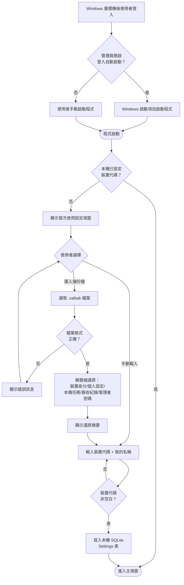

---

## 2. 通知觸發與確認狀態機（四等級共通）

對應主規劃書 27 節、UI 規劃書 9.6 節。

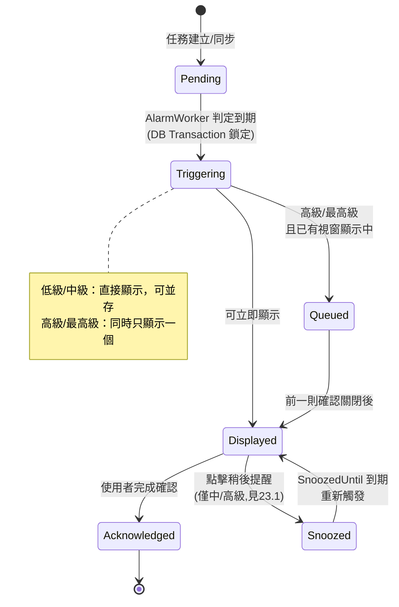

---

## 3. 四種通知等級的關閉行為決策樹

對應主規劃書 18 節、UI 規劃書 9 節。

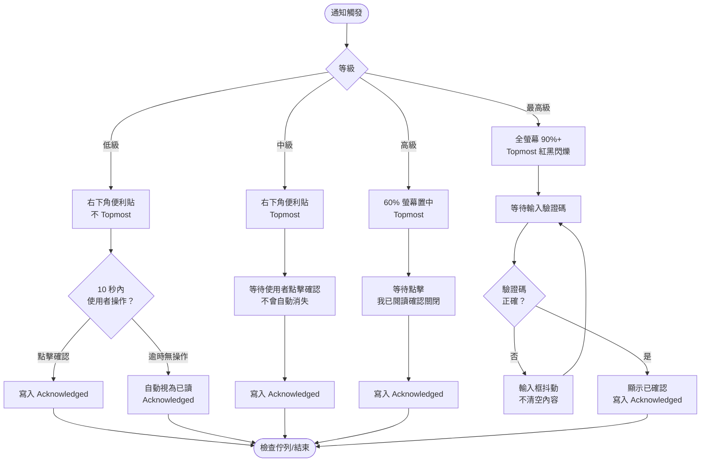

---

## 4. 任務資料來源與編輯權限流程

對應主規劃書 19B、19.1、19.2 節（Sheet A / Sheet B 雙來源架構，Sheet A 底下含三個分頁）。

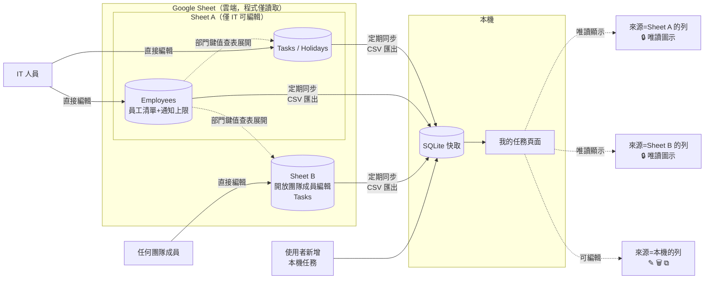

```text
Employees 與 Tasks 的虛線關係，代表「查表展開」而非同步依賴：
  Sheet A/B 的 Tasks.TargetDeviceOrName / ExcludeDeviceOrName 若填入部門名稱，
  同步時程式會查詢已快取的 Employees 資料展開成該部門所有員工，
  再依裝置代碼/使用者名稱逐一比對是否觸發（見主規劃書 19.2 節）
  Employees 分頁讀取失敗時，部門鍵值視為空清單（不展開任何人），但不影響 Tasks/Holidays 分頁本身的同步與顯示
```

---

## 5. 管理者登入與單機管理範圍

對應主規劃書 15、16、19 節（單一管理者身分，僅管本機）。

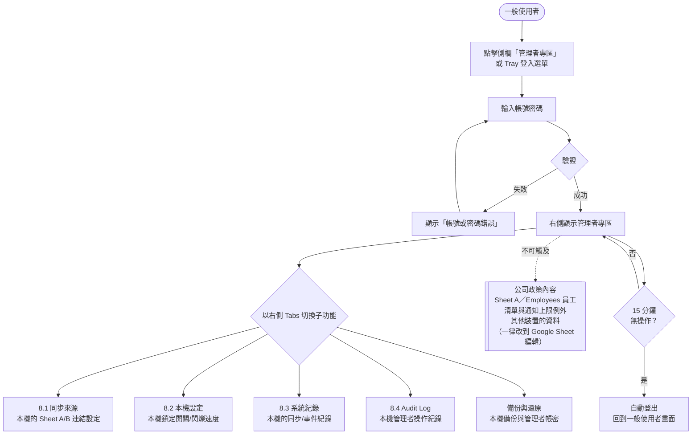

---

## 6. 本機備份與還原完整流程

對應主規劃書 19C.2 節、UI 規劃書 6.0a 節。

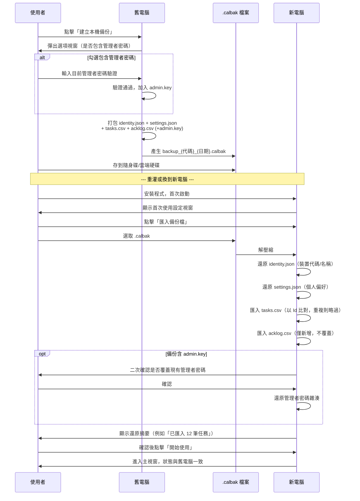

---

## 7. 多任務排隊顯示流程（高級/最高級）

對應主規劃書 27 節「多任務排隊」。

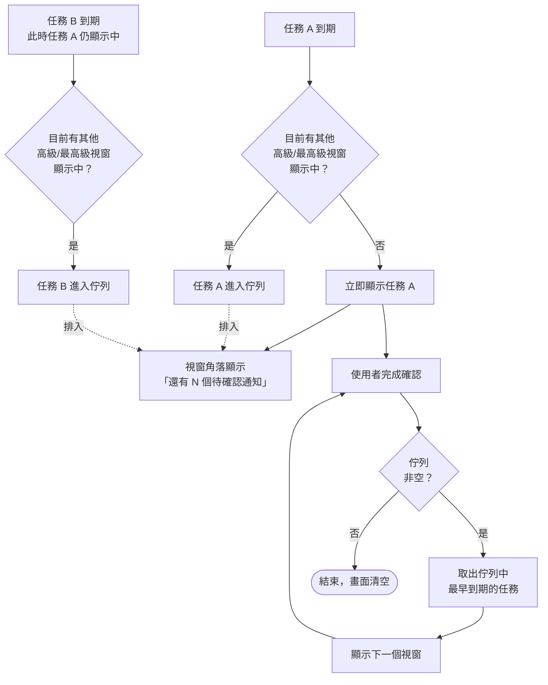

---

## 8. 系統喚醒校正流程

對應主規劃書 26.1 節。

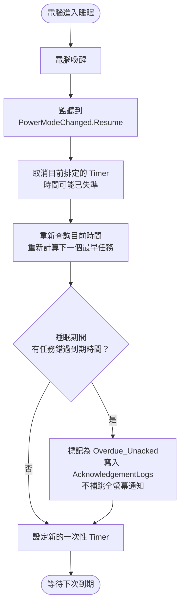

---

## 8.1 簽收紀錄集中化流程（未來開發目標，第一版／第二版不啟用）

對應主規劃書 20.3、38 節。第一版／第二版 AcknowledgementLogs 僅本機保留，下圖描述的是**未來**若啟用「方向 A：內網直連公司現有 Linux 主機」時的同步流程，目前僅在資料表預留 SyncedAt/SyncStatus 欄位（見主規劃書 21 節），尚無對應程式邏輯：

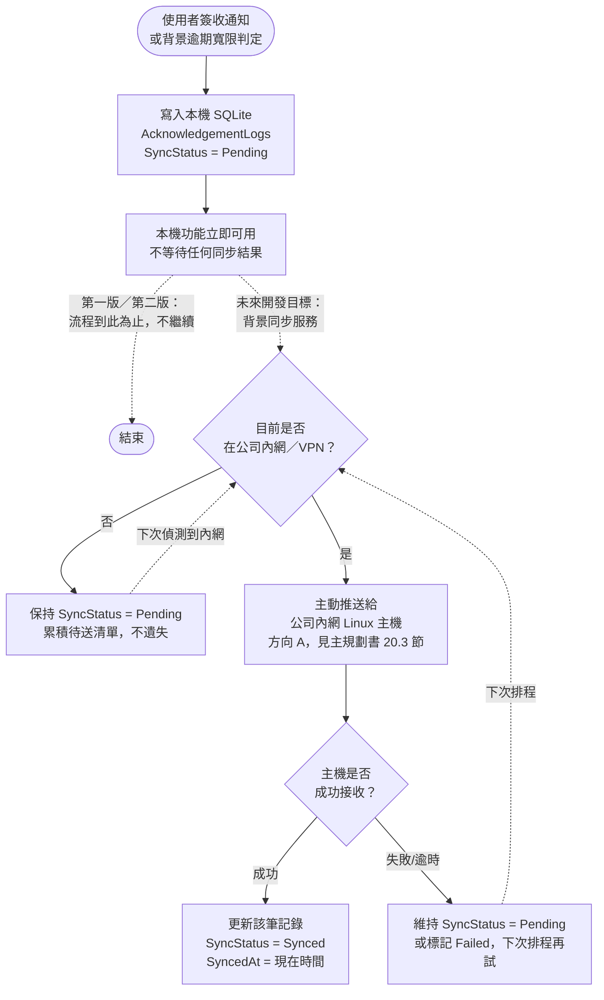

```text
關鍵設計原則（見主規劃書 20.3 節）：
  本機寫入與同步推送是兩個獨立步驟，使用者簽收動作永遠只依賴本機 SQLite 立即完成，
    不會因為同步失敗、內網不通而卡住或延遲通知視窗的關閉
  方向為「員工電腦主動推給 Linux 主機」，不是「主機來查電腦」：
    員工電腦不需開放任何連入 port、不需要固定 IP，Linux 主機只要能被動接收即可
  離線期間（筆電帶出公司、行動熱點上網）累積的 Pending 記錄不會遺失，
    只是延後同步，下次偵測到內網環境即自動補送
  此圖為未來開發目標的預期流程，實際採用哪種傳輸方式（HTTP API／共用資料夾／SFTP）
    留待該階段實作時決定，不影響本圖的整體流程邏輯
```

---

## 9. 整體資訊架構導覽圖

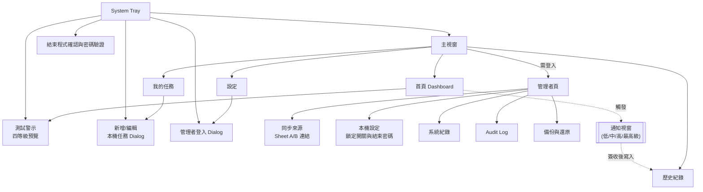

## 10. 結束程式密碼保護

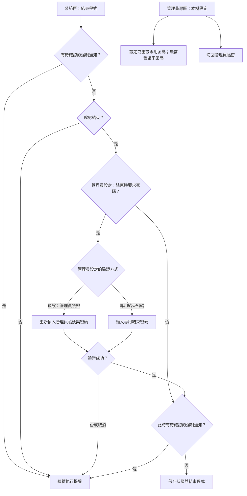
