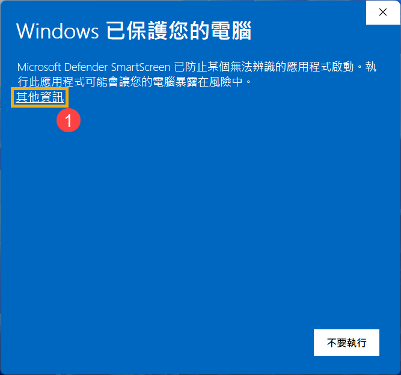
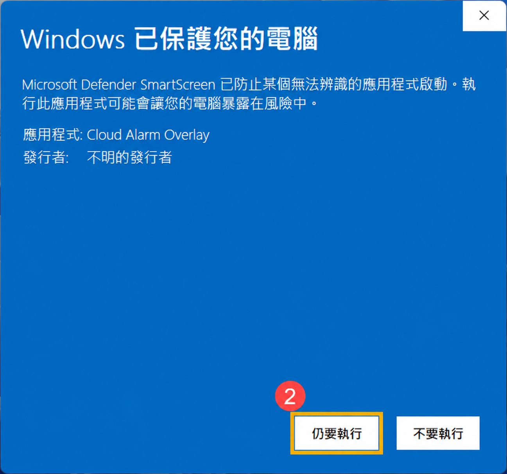

# Cloud Alarm Overlay 安裝教學

## 1. 下載安裝程式

前往 [Cloud Alarm Overlay 官方發布頁面](https://github.com/bruce-yang-422/cloud-alarm-overlay/releases)，下載所需版本的 Windows 安裝程式（檔名為 `CloudAlarmOverlay-v版本號-Setup-x64.exe`）。

下載完成後，雙擊安裝程式開始安裝。

## 2. 出現「Windows 已保護您的電腦」時

執行安裝程式時，若出現「Windows 已保護您的電腦」提示，請先確認檔案是從本專案的官方發布頁面下載，再依照下圖操作。若未出現此提示，可直接前往「完成安裝」。

1. 在提示視窗中，點擊 **「其他資訊」**（圖中標示 **①**），展開應用程式資訊。

   

2. 展開後，畫面會顯示應用程式資訊；下圖顯示的應用程式為 **Cloud Alarm Overlay**。確認是您剛下載的安裝程式後，點擊下方 **「仍要執行」**（圖中標示 **②**），繼續安裝。

   

3. 若出現「您是否要允許此應用程式變更您的裝置？」提示，點擊 **「是」**。

## 3. 完成安裝

依照安裝精靈的畫面指示完成安裝，再從 Windows 開始功能表啟動 **Cloud Alarm Overlay**。

若正在升級舊版，請先儲存編輯中的內容，並建議先備份資料；安裝期間可能會關閉正在執行的程式。

## 4. 第一次使用

1. 依畫面指示設定這台電腦的 **裝置代碼** 與 **顯示名稱**；公司部署請使用管理者提供的代碼。
2. 在 **「我的任務」** 新增本機提醒，設定內容、時間與重複規則。
3. 若需要接收團隊任務，請由管理者設定 Google Sheets 同步來源。

關閉主視窗後，程式會繼續常駐系統匣並執行提醒。若要完全結束程式，請在系統匣圖示上按滑鼠右鍵，選擇 **「結束程式」**。
